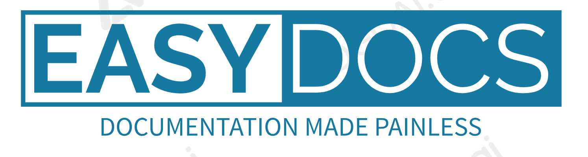

# EasyDocs
### WYSIWYG Documentation Platform

---

Welcome to EasyDocs, the WYSIWYG Documentation Platform! This web application is designed to simplify the process of creating and managing documentation for projects, products, or any content that requires structured information. The platform offers a WYSIWYG-like (What You See Is What You Get) interface, allowing permitted users to easily create and edit documentation. Additionally, it supports role-based viewing, enabling you to control access to specific documents based on user roles, with some documents accessible to the public and others restricted to authorized users only.

## Table of Contents

- [Introduction](#introduction)
- [Features](#features)
- [Installation](#installation)
- [Usage](#usage)
- [Access Control](#access-control)
- [Contributing](#contributing)
- [License](#license)

## Introduction

EasyDocs is an intuitive documentation platform that aims to streamline the process of documenting projects, products, or any content that requires organized information. It empowers software engineers and other team members to create and manage documentation efficiently, avoiding the hassle of dealing with sub-code and technicalities.

## Features

- **WYSIWYG Editor**: The platform provides a user-friendly WYSIWYG-like editor, allowing users to create and edit documentation with a familiar and intuitive interface.

- **Role-Based Viewing**: EasyDocs supports role-based access control, allowing administrators to set viewing permissions based on user roles. Some documents can be made public, while others are limited to authorized users only.

- **Document Organization**: Users can easily organize their documentation by creating categories and sub-categories, ensuring that information is well-structured and easy to find.

- **Version History**: Every update to a document is saved, creating a version history for easy tracking of changes and the ability to revert to previous versions if needed.

- **Public and Private Documents**: EasyDocs allows users to decide which documents are accessible to the public and which ones are private, ensuring the right level of visibility for each document.

- **Search Functionality**: The platform offers a powerful search feature, enabling users to quickly find specific information within the documentation.

- **Responsive Design**: EasyDocs is designed with responsiveness in mind, ensuring a seamless experience across various devices.

## Installation

Follow these steps to get EasyDocs up and running on your local development environment:

1. **Prerequisites**: Make sure you have Ruby (version X.X.X) and Rails (version X.X.X) installed on your system.

2. **Clone the repository**: Use `git clone` to clone this repository to your local machine.

3. **Install dependencies**: Navigate to the project directory and run `bundle install` to install the required gems.

4. **Database setup**: Run `rails db:setup` to create and seed the database with initial data.

5. **Start the server**: Launch the application by running `rails server`. EasyDocs will be accessible at `http://localhost:3000`.

6. **Configurations**: Customize the application settings and credentials in `config/application.yml` file.

## Usage

1. **User Registration**: Users can sign up using their email address and create an account on the platform.

2. **Login**: Registered users can log in with their credentials and access the EasyDocs platform.

3. **Create Documentation**: Click on "Create New Document" to begin writing your documentation using the intuitive WYSIWYG editor.

4. **Organize**: Assign appropriate categories and sub-categories to your documents to keep them well-organized.

5. **Role-Based Viewing**: Set the viewing permissions for each document, deciding whether it should be accessible to the public or restricted to authorized users.

6. **Search**: Utilize the search feature to find specific information within your documentation quickly.

7. **Versioning**: Access the version history of a document to review changes and revert to previous versions if needed.

## Access Control

EasyDocs offers role-based access control for viewing documents. Here are the different user roles and their access levels:

- **Admin**: Administrators have full access to all documents and can manage user permissions.

- **Authorized User**: Authorized users have access to private documents as determined by the document creator or admin.

- **Public User**: Public users can access documents marked as public by the document creator.

## License

EasyDocs is open-source software licensed under the [MIT License](LICENSE).

---
Thank you for choosing EasyDocs as your documentation platform. If you have any questions or need assistance, feel free to contact us at support@example.com. Happy documenting!